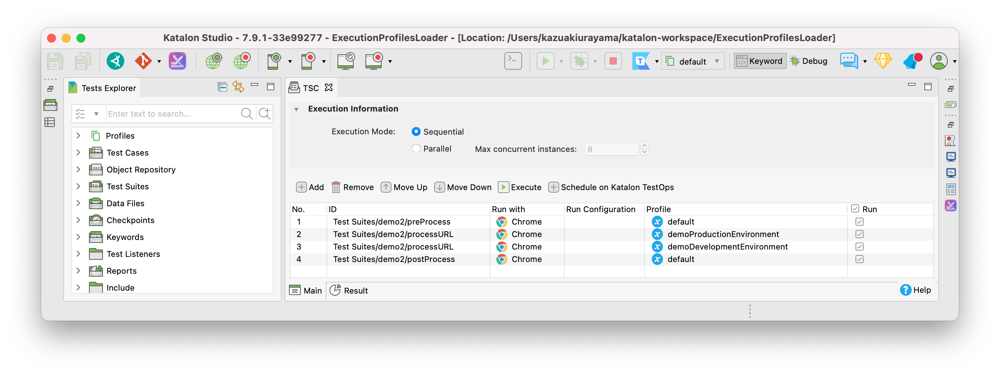

# ExecutionProfilesLoader

This project was developed using Katalon Studio v7.6.6. It should work on every version above v7.0.

## Background

[GlobalVariables and Execution Profile](https://docs.katalon.com/katalon-studio/docs/execution-profile-v54.html) is a feature in Katalon Studio that enable users parameterise values of variables out of test script source. With GlobalVariables we can reduce code duplication and reuse test scripts for multiple cases.

The following screenshot shows how we apply Execution Profiles to Test Suites.

As this screenshot shows, a user has to choose a single Execution Profile for a test run before you start it.

## Problems to solve

In my humble option, Katalon Studio provides only basic set of capabilities for utilizing and administrating GlobalVariables. I think that Katalon is designed with implicit assumption that a user would have just a few Execution Profiles --- less than 5?, just small number of GlobalVariables --- less than 10?. This assumption may apply to some projects but not always.

As my projects grow, I demanded more complex usages.
Please imagine a situation where I have got many Execution Profiles with many GlobalVariables. For example, 50 Execution Profiles each of which contains 5 GlobalVariables, resulting in over 200 values of GV. A single name of GlobalVariable (e.g, `URL`, `ENVIRONMENT`) appears in multiple Execution Profiles with different initial values set.

I found the following problems:

1.  For example, I know my project has a GlobalVariable `ENVIRONMENT` declared in multiple Execution Profiles. But I can not remember which Profiles contains that GV. I have to spend quite some time looking into the Profiles one by one for the `ENVIRONMENT`. **Katalon Studio does not provide any feature that helps me looking up a GlobalVariable amongst bunches of Execution Profiles.**

2.  I want to apply 2 or more Profiles to a single test run. In other words, I want to be able to modularize Execution Profiles into parts; and build a full set of GlobalVariables for a test run by joining selected modules.

3.  I want my test script to programmatically decide which Profiles to load.

The `ExecutionProfilesLoader` project addresses all these problems and provides sufficient solutions for me. Please have a look into the document for more detail.

-   <https://kazurayam.github.io/ExecutionProfilesLoader/>

## How to use this artifact in your project

In order to use this library, you need to download the jar into the `Drivers` folder of your Katalon Studio Project. See the following Katalon docs for detail.

-   [Manually Copy and Past JAR files to the Drivers folder](https://docs.katalon.com/katalon-studio/docs/external-libraries.html#manually-copy-and-paste-jar-files-to-the-drivers-folder)

The artifact of ExecutionProfilesLoader project is available at the Maven Central Repository. See

-   [Maven Central: ExecutionProfilesLoader project](https://mvnrepository.com/artifact/com.kazurayam/ExecutionProfilesLoader)

## API doc

-   [ExecutionProfilesLoader Groovydoc](https://kazurayam.github.io/ExecutionProfilesLoader/api/index.html)
