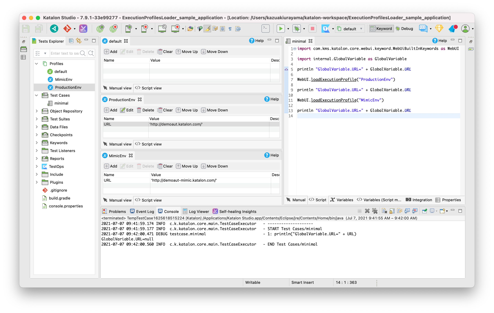

Loading Execution Profile in Test Case by Keyword
=======

## Problem to solve

I hope Katalon Studio to provide a built-in keyword `WebUI.loadExecutionProfile(String profileName)`. The keyword should enable me to load the specified Execution Profile dynamically in a Test Case.

Let me show you an example of what I desire.

1. I will have the `default` Execution Profile empty.
2. I will create an Execution Profile named `ProductionEnv`. It will contain a GlobalVariable named `URL` with value `http://demoaut.katalon.com/`.
3. I will create another Execution Profile named `MimicEnv`. It will contain a GlobalVariable named `URL` with value `http://demoaut-mimic.kazurayam.com/`.
4. I will write a Test Case named `mininal`. The script code will be as follows:
```
import com.kms.katalon.core.webui.keyword.WebUiBuiltInKeywords as WebUI
import internal.GlobalVariable as GlobalVariable

println "GlobalVariable.URL=" + GlobalVariable.URL

WebUI.loadExecutionProfile("ProductionEnv")
println "GlobalVariable.URL=" + GlobalVariable.URL

WebUI.loadExecutionProfile("MimicEnv")
println "GlobalVariable.URL=" + GlobalVariable.URL
```



When I execute the script while I select the empty `default` profile, I hope to see the following output in the Console:

```
GlobalVariable.URL=null
...
GlobalVariable.URL=http://demoaut.katalon.com
...
GlobalVariable.URL=http://demoaut-mimic.kazurayam.com
```

Please note that the value of `GlobalVariable.URL` is dynamically updated by calling the `WebUI.loadExecutionProfile(String profileName)` Keyword in the Test Case script. You can call that Keyword multiple times in a Test Case. An Execution Profile may contain multiple GlobalVariables (name, value). All of these loaded GlobalVariables should be added/updated by the Keyword call.

Similarly similar keywords `WS.loadExecutionProfile(String profileName)` and `Mobile.loadExecutionProfile(String profileName)` are also desired. These will do the same thing.

Why do I need it? --- I will tell it later as it requires a very long description.

However, in fact, The `minimal` script will not even compile because Katalon Studio does not support the keyword `WebUI.loadExecutionProfile()`.

## Solution

I have developed a set of Groovy classes that enables my Test Case scripts to load Execption Profiles or to add/update GlobalVariables dynamically runtime. A distributable jar is provided. Once you plugin the jar into your Katalon Studio project, you can use Custom Keywords.

## Description

### Downloading the jar

Visit [the Releases page](https://github.com/kazurayam/ExecutionProfilesLoader/releases), find the latest version of `ExecutionProfilesLoader-x.x.x.jar`, download it.

You should place the jar into the `Drivers` directory of your Katalon Studio project. Stop and restart KS in order to let KS acknowlege the added jar.

### How to use it

I have already showed a minimalistic example above. 

1. Create a Exceution Profile named `ProductionEnv` with a GlobalVariable named `URL` in String type with value of `http://demoaut.katlaon.com/`.

2. Create a Test Case with any name; e.g, `minimal`. The script should be:

```
CustomKeywords."com.kazurayam.ks.globalvariable.ExecutionProfilesLoader.loadProfile"("ProductionEnv")
println "GlobalVariable.URL=" + GlobalVariable.URL
```

3. or you can also write
```
import com.kazurayam.ks.globalvariable.ExecutionProfilesLoader
new ExecutionProfilesLoader().loadProfile"("ProductionEnv")
println "GlobalVariable.URL=" + GlobalVariable.URL
```

4. Execute the test case while you specify "default" Execution Profile. You should find the following output in the Console. The value `http://demoaut.katalon.com/` is loaded from the `ProductionEnv` Execution Profile by the Custom keyword.

```
GlobalVariable.URL=http://demoaut.katalon.com/
```


## Long story

Why do I want to load a Execution Profile by a Keyword in a Test Case? This question deserves a long description. I will write it here as a note for me ... it took me nearly 3 years to solve this problem.


