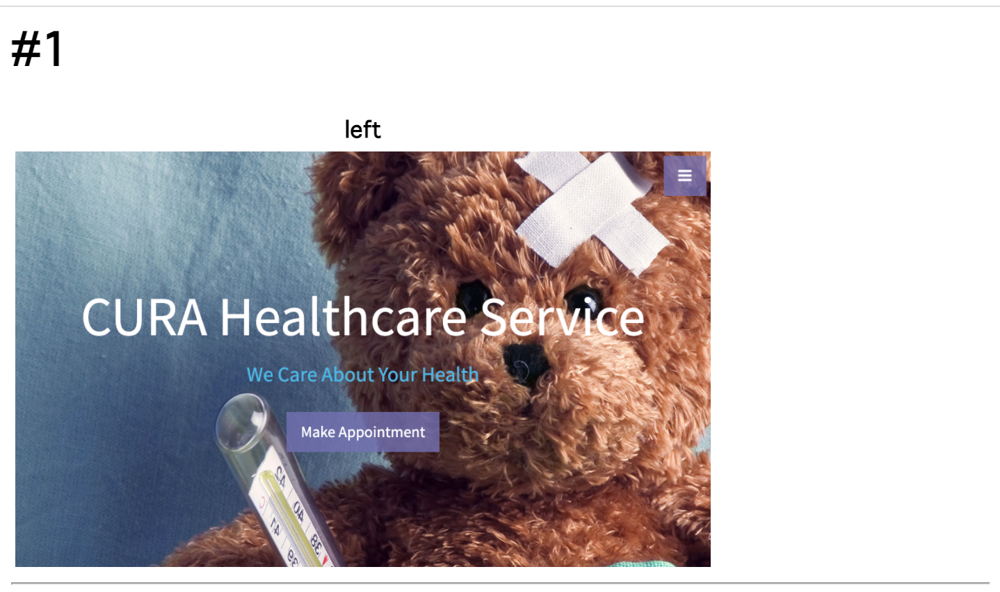
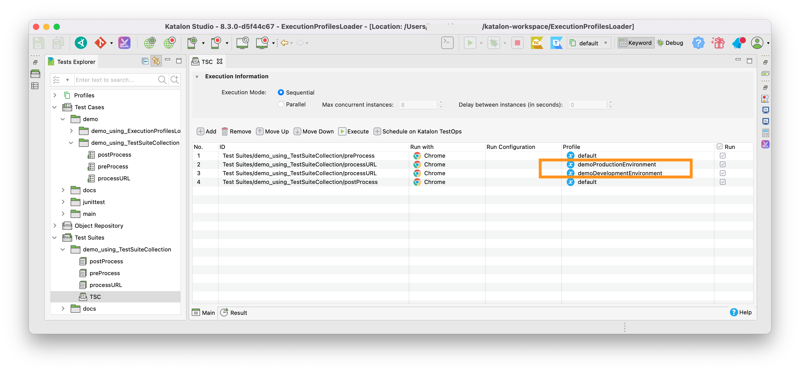
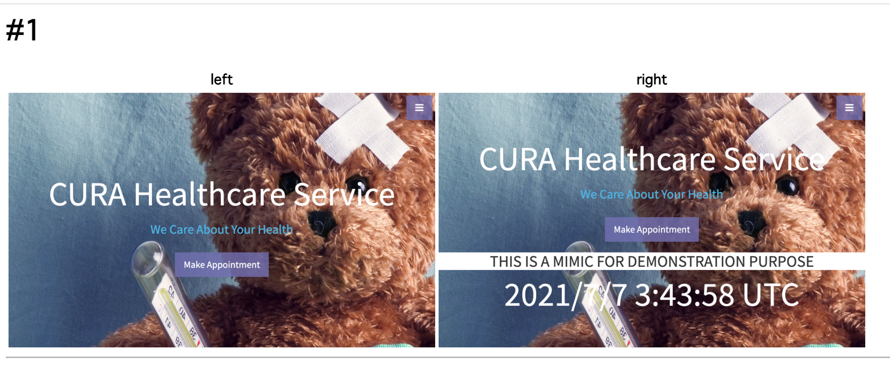

Loading Execution Profile in Test Case by Keyword
=======

<p>@date July 2021</p>
<p>@author kazurayam</p>

## Problem to solve

I hope Katalon Studio to provide a built-in keyword `WebUI.loadExecutionProfile(String profileName)`. The keyword should enable me to load the specified Execution Profile dynamically in a Test Case.

Let me show you an example of what I desire.

1. I will have the `default` Execution Profile empty.
2. I will create an Execution Profile named `ProductionEnv`. It will contain a GlobalVariable named `URL` with value `http://demoaut.katalon.com/`.
3. I will create another Execution Profile named `MimicEnv`. It will contain a GlobalVariable named `URL` with value `http://demoaut-mimic.kazurayam.com/`.
4. I will write a Test Case named `mininal`. The script code will be as follows:
```
import com.kms.katalon.core.webui.keyword.WebUiBuiltInKeywords as WebUI
import internal.GlobalVariable as GlobalVariable

println "GlobalVariable.URL=" + GlobalVariable.URL

WebUI.loadExecutionProfile("ProductionEnv")
println "GlobalVariable.URL=" + GlobalVariable.URL

WebUI.loadExecutionProfile("MimicEnv")
println "GlobalVariable.URL=" + GlobalVariable.URL
```


When I execute the script while I select the empty `default` profile, I hope to see the following output in the Console:

```
GlobalVariable.URL=null
...
GlobalVariable.URL=http://demoaut.katalon.com
...
GlobalVariable.URL=http://demoaut-mimic.kazurayam.com
```

Please note that the value of `GlobalVariable.URL` is dynamically updated by calling the `WebUI.loadExecutionProfile(String profileName)` Keyword in the Test Case script. You can call that Keyword multiple times in a Test Case. An Execution Profile may contain multiple GlobalVariables (name, value). All of these loaded GlobalVariables should be added/updated by the Keyword call.

I would desire similar keywords `WS.loadExecutionProfile(String profileName)` and `Mobile.loadExecutionProfile(String profileName)` as well. These will do the same thing.

Why do I need it? --- I will tell it later as it requires a very long description.

However, in fact, The `minimal` script will not even compile because Katalon Studio does not support the keyword `WebUI.loadExecutionProfile()`.

## Solution

I have developed a set of Groovy classes that enables my Test Case scripts to load Execption Profiles or to add/update GlobalVariables dynamically runtime. A distributable jar is provided. Once you plugin the jar into your Katalon Studio project, you can use Custom Keywords.

## Description

### Downloading the jar

Visit [the Releases page](https://github.com/kazurayam/ExecutionProfilesLoader/releases), find the latest version of `ExecutionProfilesLoader-x.x.x.jar`, download it.

You should place the jar into the `Drivers` directory of your Katalon Studio project. Stop and restart KS in order to let KS acknowlege the added jar.

### How to use it

I have already showed a minimalistic example above. 

1. Make sure you have an Execution Profile named `default`, which does NOT contain a GlobalVariable named `URL`.

2. Create an Exceution Profile named `ProductionEnv` with a GlobalVariable named `URL` of String type with value of `http://demoaut.katlaon.com/`.

3. Create a Test Case with any name; e.g, `minimal`. The script should be:

```
CustomKeywords."com.kazurayam.ks.globalvariable.ExecutionProfilesLoader.loadProfile"("ProductionEnv")

println "GlobalVariable.URL=" + GlobalVariable.URL
```

4. or you can also write
```
import com.kazurayam.ks.globalvariable.

new ExecutionProfilesLoader().loadProfile("ProductionEnv")

println "GlobalVariable.URL=" + GlobalVariable.URL
```

5. Run the "minimal" Test Case while you choose the "default" Execution Profile. You should find the following output in the Console. The value `http://demoaut.katalon.com/` is loaded from the `ProductionEnv` Execution Profile by the Custom keyword.

```
GlobalVariable.URL=http://demoaut.katalon.com/
```

### GroovyDoc

You can read the API doc at 
- https://kazurayam.github.io/ExecutionProfilesLoader/api/index.html

## Long story

Why do I want a Keyword to load a Execution Profile in a Test Case? 

This question deserves a long description. I will write it here as a note for me. In fact it took me 3 years to solve this problem.

### demo1

A few years ago when I got started with Katalon Studio ver 5.x, I initiated a small project. I wanted to automate a task of taking a lot of screenshots of a web system. Also I learned a Katalon Studio feature [Execution Profile](https://docs.katalon.com/katalon-studio/docs/execution-profile-v54.html). I thought it would be a good idea to store URL strings of the target web pages in a Execution Profile so that I can reuse a set of test script for multiple environments (Production, Development, Staging, etc).

1. I made 2 Execution Profiles: `Profiles/demoProductionEnvironment` and `Profiles/demoDevelopmentEnvironment`. Both defines a GlobalVariable named `URL1`. Each had valudes of `http://demoaut.katalon.com` and `http://demoaut-mimic.kazurayam.com`. 

2. I made a Test Case script [Test Cases/demo1/takeScreenshotAndReport](Scripts/demo1/takeScreenshotAndReport/Script1625628385149.groovy). This script does the following processing:
  - initialize a directory for outputs
  - open browser, navigate to `GlobalVariable.URL1`
  - take screenshot and save it into the output directory
  - compile a html with which you can view the screenshot in browser.

3. When you run the script `demo1/takeScreenshotAndReport` while you choose the Execution profile `demo1ProductionEnvironment`, you will obtain a HTML report which shows the screenshot of `http://demoaut.katalon.com/` like this: 

4. When you run the script `demo1/takeScreenshotAndReport` while you choose the Execution profile `demo1DevelopmentEnvrironment`, you will obtain a HTML report which shows the screenshot of `http://demoaut-mimic.kazurayam.com/`.

5. The script `demo1/takeScreenshotAndReport` is unable to take screenshots of 2 URLs and compile a single HTML report which showd 2 screenshots together.


### demo2

The system had multiple environments: "Production Environment" and "Development Environement. I wanted to compare screenshots of web pages of these 2 environments to find out any unexpected differences.

Let me show you an implementation here. 

1. I made a Test Suite Collection `Test Suites/demo2/TSC`. You can run the demo2 by running the `TSC`. It includes 4 instructions to run child Test Suites.
- `Test Suites/demo2/preProcess`
- `Test Suites/demo2/processURL` with Execution Profile `demoProductionEnvironment` specified
- `Test Suites/demo2/processURL` with Execution Profile `demoDevelopmentEnvrironment` specified
- `Test Suites/demo2/postProcess` 

2. `Test Suites/demo2/preProcess` calls [`Test Cases/demo2/preProcess`](Scripts/demo2/preProcess/Script1625627914911.groovy). The Test Case does initializing the output directory

4. `Test Suites/demo2/processURL` calls [`Test Cases/demo2/processURL`](Scripts/demo2/processURL/Script1625627914915.groovy). The Test Case opens the URL in browser, takes screeshot, save the image into file. The URL will be retrieved as the value of `GlobalVariable.URL1`. Therefore it was necessary to execute `Test Suites/demo2/processURL` twice while specifying 2 Exceution Profiles `demoProductionEnvironment` and `demoDevelopmentEnvironment` for each.

4. `Test Suites/demo2/postProcess` calls [`Test Cases/demo2/postProcess`](Scripts/demo2/postProcess/Script1625627914906.groovy). The Test Case compiles a HTML report, which looks like this:


#### Appreciation of demo2

What do you think of this implementation? I think this is terribly complexed.

A single Test Case script [`Test Cases/demo1/takeScreenshotAndReport`](Scripts/demo1/takeScreenshotAndReport/Script1625628385149.groovy) could implement similar processing. On the other hand, the demo2 involves a Test Suite Collection, 3 Test Suite, 3 Test Cases. This lots of components. Why do I need them?

Test Suite Collection is the only way provided by Katalon Studio for me to apply 2 different Execution Profiles (`demoProductionEnvironment` and `demoDevelopmentEnvironment`) to a single script (for taking screenshots of URLs). This is the reasone why I needed this complication.

### demo3

So I have developed a custom keyword `com.kazurayam.ks.globalvariable.ExecutionProfilesLoader.loadProfile(String profileName)`. This enabled me simplify my cripts that takes screenshots of the 2 environements and compile a single HTML report.

[Test Cases/demo3/batch](Scripts/demo3/batch/Script1625627870198.groovy) does the following stuff in a single script.
- initialize the output directory
- load Execution Profile `demoProductionEnvironment` to find the value of `GlobalVariable.URL1`; open the URL, take screenshot, save the image into a file.
- load Exceution Profile `demoDevelopmentEnvironement` to find out the value of `GlobalVariable.URL1`; open the URL, take screenshot, save the image into a file.
- compile a HTML report, like this: 

#### Appreciaton of demo3

The [Test Cases/demo3/batch](Scripts/demo3/batch/Script1625627870198.groovy) is short and simple enough. Far easier to understand and maintain than the complicated codes of demo2.

## Conclusion

Once I developed and published  [VisualTestingInKatalonStudio](https://github.com/kazurayam/VisualTestingInKatalonStudio) project. I believe it is useful but is too much complicated. It's code structure is like demo2. It involves multiple Test Suite Collections, many Test Suites, a lot of Test cases. H'm...

Now I have got an idea of simplifying that project using the `ExecutionProfilesLoader`. Yes, I believe it is possible to accomplish.
