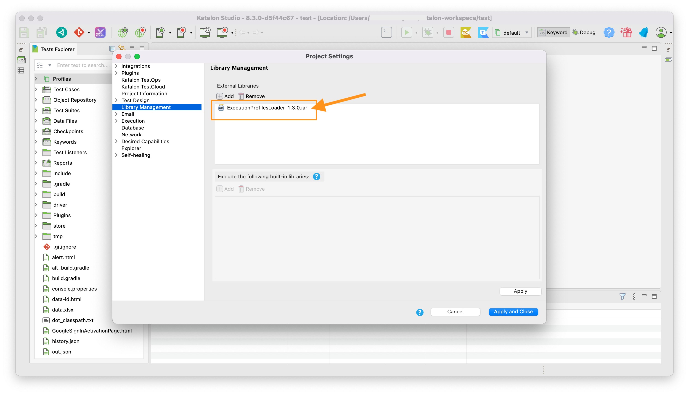
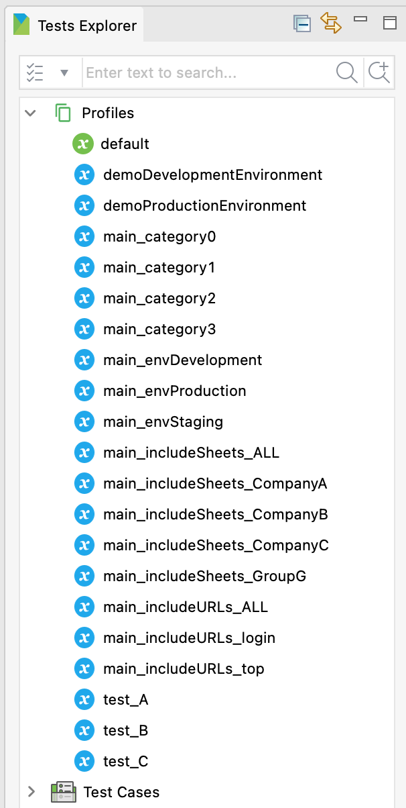

-   [ExecutionProfilesLoader](#executionprofilesloader)
    -   [How to use this library in your Katalon Studio project](#how-to-use-this-library-in-your-katalon-studio-project)
    -   [Listing Profiles and GlobalVariables](#listing-profiles-and-globalvariables)
        -   [List all Profiles](#list-all-profiles)

# ExecutionProfilesLoader

## How to use this library in your Katalon Studio project

You can download the latest jar file from Maven Central repository

-   [Maven Central](https://mvnrepository.com/artifact/com.kazurayam/ExecutionProfilesLoader)

Please have a look at Katalon’s document

-   [Manually Copy and Past JAR files to the Drivers folder](https://docs.katalon.com/katalon-studio/docs/external-libraries.html#manually-copy-and-paste-jar-files-to-the-drivers-folder)

You want to configure your project like this:

Once you locate the jar, pleast stop and restart Katalon Studio to let it acknowledge the added jar.

## Listing Profiles and GlobalVariables

### List all Profiles

Given that there are many Execution Profiles defined in a project:

Problem to solve: I want to list all Execution Profile names and print them in the console.

Sample Test Case:

    List<String> profiles = CustomKeywords.'com.kazurayam.ks.globalvariable.ProfilesHelper.listAllProfiles'()

    for (String profile in profiles) {
        println profile
    }

Output:

    2022-05-06 22:32:10.453 INFO  c.k.katalon.core.main.TestCaseExecutor   - --------------------
    2022-05-06 22:32:10.458 INFO  c.k.katalon.core.main.TestCaseExecutor   - START Test Cases/main/1_listing/1_listAllProfiles
    2022-05-06 22:32:11.169 INFO  k.k.c.m.CustomKeywordDelegatingMetaClass - com.kazurayam.ks.globalvariable.ProfilesHelper.listAllProfiles is PASSED
    default
    demoDevelopmentEnvironment
    demoProductionEnvironment
    main_category0
    main_category1
    main_category2
    main_category3
    main_envDevelopment
    main_envProduction
    main_envStaging
    main_includeSheets_ALL
    main_includeSheets_CompanyA
    main_includeSheets_CompanyB
    main_includeSheets_CompanyC
    main_includeSheets_GroupG
    main_includeURLs_ALL
    main_includeURLs_login
    main_includeURLs_top
    test_A
    test_B
    test_C
    2022-05-06 22:32:11.228 INFO  c.k.katalon.core.main.TestCaseExecutor   - END Test Cases/main/1_listing/1_listAllProfiles
