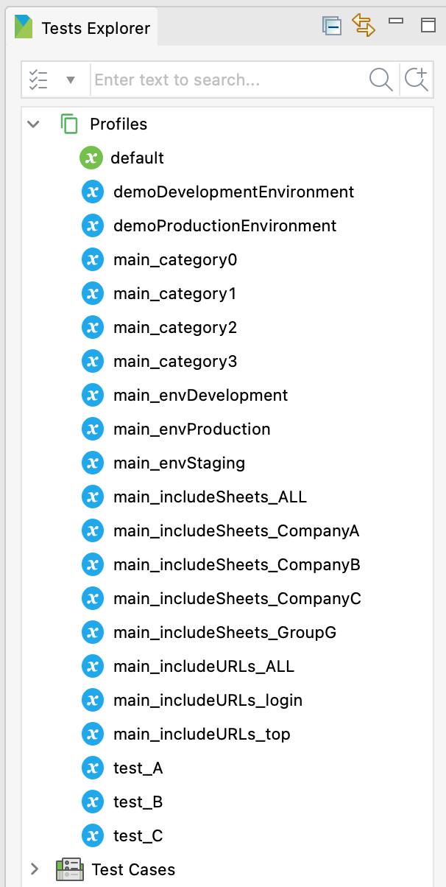

= ExecutionProfilesLoader and other helper classes that extend GlobalVariable in Katalon Studio

== How to use this library in your Katalon Studio project

You can download the latest jar file from Maven Central repository

- https://mvnrepository.com/artifact/com.kazurayam/ExecutionProfilesLoader[Maven Central]

Please have a look at Katalon's document

- https://docs.katalon.com/katalon-studio/docs/external-libraries.html#manually-copy-and-paste-jar-files-to-the-drivers-folder[Manually Copy and Past JAR files to the Drivers folder]

You want to configure your project like this:

image::images/ExternalLibraries.png[]

Once you locate the jar, pleast stop and restart Katalon Studio to let it acknowledge the added jar.

== 1. Listing Profiles and GlobalVariables defined in the Profiles storage

If you want to use GlobalVariables in a Katalon Studio project, you need to work out on the Katalon Studio GUI and create a *Profile* in the `Profiles` directory. In each Profile you declare *GlobalVariable*(s) with name and initial values. Unfortunately Katalon Studio provides no API with which your test scripts scan through the entities contained in the `Profiles` directory. This library provides some Custom Keywords that enable your test scripts look over the Profiles and the GlobalVariables defined in the `.glbl` files under the `Profiles` directory.

=== 1.1 List all Profiles

Given that there are many Execution Profiles defined in a project, for example like this:

Problem to solve: 

I want my test script get a list of all names of Execution Profiles and print them in the console.

Sample Test Case:

[source, groovy]
----
include::../Scripts/docs/1_looking-over_Profiles/1_listAllProfiles/Script1651976508120.groovy[]
----

Output:
----
2022-05-06 22:32:10.453 INFO  c.k.katalon.core.main.TestCaseExecutor   - --------------------
2022-05-06 22:32:10.458 INFO  c.k.katalon.core.main.TestCaseExecutor   - START Test Cases/main/1_listing/1_listAllProfiles
2022-05-06 22:32:11.169 INFO  k.k.c.m.CustomKeywordDelegatingMetaClass - com.kazurayam.ks.globalvariable.ProfilesHelper.listAllProfiles is PASSED
default
demoDevelopmentEnvironment
demoProductionEnvironment
main_category0
main_category1
main_category2
main_category3
main_envDevelopment
main_envProduction
main_envStaging
main_includeSheets_ALL
main_includeSheets_CompanyA
main_includeSheets_CompanyB
main_includeSheets_CompanyC
main_includeSheets_GroupG
main_includeURLs_ALL
main_includeURLs_login
main_includeURLs_top
test_A
test_B
test_C
2022-05-06 22:32:11.228 INFO  c.k.katalon.core.main.TestCaseExecutor   - END Test Cases/main/1_listing/1_listAllProfiles
----

=== 1.2 List profiles filtered by name with regex

Problem to solve: 

I want my test script to select some of Execution Profiles by name with Regular Expression.

Sample Test Case:

[source, groovy]
----
include::../Scripts/docs/1_looking-over_Profiles/2_listProfiles/Script1651976508118.groovy[]
----

Please note, `"test_\\w+"` is a link:https://docs.oracle.com/javase/7/docs/api/java/util/regex/Pattern.html[Pattern] of Regular Expression in Java. It matches with a Profile name that starts with a string "`test_`" followed by 1 or more alpha-numeric characters. For example, the Profile `test_A` does match, but the Profile `default` doesn't.

Output:
----
2022-05-07 09:35:09.118 INFO  c.k.katalon.core.main.TestCaseExecutor   - --------------------
2022-05-07 09:35:09.122 INFO  c.k.katalon.core.main.TestCaseExecutor   - START Test Cases/main/1_listing/2_listProfilesFiltered
2022-05-07 09:35:09.767 INFO  k.k.c.m.CustomKeywordDelegatingMetaClass - com.kazurayam.ks.globalvariable.ProfilesHelper.listProfiles is PASSED
test_A
test_B
test_C
2022-05-07 09:35:09.822 INFO  c.k.katalon.core.main.TestCaseExecutor   - END Test Cases/main/1_listing/2_listProfilesFiltered
----

=== 1.3 List all GlobalVariables defined in the Profiles directory

Problem to solve:

I want my test script to list all GlobalVariables defined in all Execution Profiles. If a single GlobalVariable name appears in 2 Profiles, I want 2 lines of the GlobalVariable with different Profile name are listed.

The output line should show the following items

- name of GlobalVariable 
- name of Execution Profile which contains the GV
- initial value of the GV declared in the Profile

These 3 items should be delimited by TAB characters.

Sample code:

[source,groovy]
----
include::../Scripts/docs/1_looking-over_Profiles/3_listAllGlobalVariable/Script1651976508116.groovy[]
----

Output:

----
2022-05-07 20:20:17.797 INFO  c.k.katalon.core.main.TestCaseExecutor   - --------------------
2022-05-07 20:20:17.804 INFO  c.k.katalon.core.main.TestCaseExecutor   - START Test Cases/main/1_listing/3_listAllGlobalVariableInProfile
2022-05-07 20:20:19.259 INFO  k.k.c.m.CustomKeywordDelegatingMetaClass - com.kazurayam.ks.globalvariable.ProfilesHelper.listAllGlobalVariableInProfile is PASSED
AVAR1	test_A	'I\'m from test_A'
AVAR2	test_A	999
AVAR3	test_A	[('keyA') : 'valueA', ('keyB') : true]
BVAR1	test_B	'I\'m from test_B'
CATEGORY	default	0
CATEGORY	main_category0	0
CATEGORY	main_category1	1
CATEGORY	main_category2	2
CATEGORY	main_category3	3
CONFIG	default	'./Include/fixture/Config.xlsx'
DEBUG_MODE	default	false
EMPTY_VARIABLE	test_C	''
ENVIRONMENT	default	''
ENVIRONMENT	main_envDevelopment	'Development'
ENVIRONMENT	main_envProduction	'Production'
ENVIRONMENT	main_envStaging	'Staging'
Hostname	default	'demoaut.katalon.com'
INCLUDE_SHEETS	default	[]
INCLUDE_SHEETS	main_includeSheets_ALL	[]
INCLUDE_SHEETS	main_includeSheets_CompanyA	['CompanyA']
INCLUDE_SHEETS	main_includeSheets_CompanyB	['CompanyB']
INCLUDE_SHEETS	main_includeSheets_CompanyC	['CompanyC']
INCLUDE_SHEETS	main_includeSheets_GroupG	['CompanyL', 'CompanyM', 'CompanyN']
INCLUDE_URLS	default	[]
INCLUDE_URLS	main_includeURLs_ALL	[]
INCLUDE_URLS	main_includeURLs_login	['login.html']
INCLUDE_URLS	main_includeURLs_top	['top.html']
NULL_VARIABLE	test_C	null
SAVE_HTML	default	false
TIMEOUT	default	10
URL1	demoDevelopmentEnvironment	'http://demoaut-mimic.kazurayam.com/'
URL1	demoProductionEnvironment	'http://demoaut.katalon.com/'
myList	test_C	['I\'m from test_C', 8090]
2022-05-07 20:20:19.388 INFO  c.k.katalon.core.main.TestCaseExecutor   - END Test Cases/main/1_listing/3_listAllGlobalVariableInProfile

----

=== 1.4 List GlobalVariables filtered by its name

Problem to solve:

I want my test script to list GlobalVariables filtered by its name with Regular Expression.

Sample code:

[source,groovy]
----
include::../Scripts/docs/1_looking-over_Profiles/4_listGlobalVariables/Script1651991095473.groovy[]
----

The Regular Expression `ENV.\*` matches with a GlobalVariable name which starts with a string "`ENV`" followed by zero or more any characters.

Output:

----
2022-05-07 20:53:12.722 INFO  c.k.katalon.core.main.TestCaseExecutor   - --------------------
2022-05-07 20:53:12.727 INFO  c.k.katalon.core.main.TestCaseExecutor   - START Test Cases/main/1_listing/4_listGlobalVariableInProfile
2022-05-07 20:53:13.800 INFO  k.k.c.m.CustomKeywordDelegatingMetaClass - com.kazurayam.ks.globalvariable.ProfilesHelper.listGlobalVariableInProfile is PASSED
ENVIRONMENT	default	''
ENVIRONMENT	main_envDevelopment	'Development'
ENVIRONMENT	main_envProduction	'Production'
ENVIRONMENT	main_envStaging	'Staging'
2022-05-07 20:53:13.853 INFO  c.k.katalon.core.main.TestCaseExecutor   - END Test Cases/main/1_listing/4_listGlobalVariableInProfile
----

=== 1.5 List GlobalVariables filtered by the GV name and the Profile name with Regex

Problem to solve:

I want my test script to list GlobalVariables while filtering by the name of GlobalVariable and by the name of containing Profile, both with Regular Expression.

Sample code:

[source, groovy]
----
include::../Scripts/docs/1_looking-over_Profiles/5_listGlobalVariablesInProfiles/Script1651991109650.groovy[]
----

The `listGlobalVariablesInProfiles` method takes 2 arguments. The 1st argument is a regex that matches with the name of GlobalVariable. The 2nd argument is a regex that matches with the name of Profile.

Output:
----
2022-05-08 21:36:22.747 INFO  c.k.katalon.core.main.TestCaseExecutor   - --------------------
2022-05-08 21:36:22.750 INFO  c.k.katalon.core.main.TestCaseExecutor   - START Test Cases/docs/1_looking-over_Profiles/5_listGlobalVariablesInProfiles
2022-05-08 21:36:23.974 INFO  k.k.c.m.CustomKeywordDelegatingMetaClass - com.kazurayam.ks.globalvariable.LookOverExecutionProfilesKeyword.listGlobalVariablesInProfiles is PASSED

ENVIRONMENT	default	''
URL1	demoDevelopmentEnvironment	'http://demoaut-mimic.kazurayam.com/'
URL1	demoProductionEnvironment	'http://demoaut.katalon.com/'

2022-05-08 21:36:24.016 INFO  c.k.katalon.core.main.TestCaseExecutor   - END Test Cases/docs/1_looking-over_Profiles/5_listGlobalVariablesInProfiles
----

== 2. Loading Profiles by code

Katalon Studio requires you to specify a Profile before launching a test. Katalon Studio provides no way to load Profile(s) by code while your test is running. I argue that this design is short for a lot of test scenarios.

This library provides a few Custom Keywords that supports more flexible Profiles loading.

=== 2.1 Loading a Profile programaticaly

The following sample code shows how to 
1. programaticaly resolve a name of Profile to load
2. load the Profile and update the values of GlobalVariables with the initial values declared in the Profile.

Sample code:

[source, groovy]
----
include::../Scripts/docs/2_loading_Profiles/1_loading_a_Profile_programatically/Script1651991138024.groovy[]
----

Output:

----
2022-05-08 22:04:35.727 INFO  c.k.katalon.core.main.TestCaseExecutor   - --------------------
2022-05-08 22:04:35.731 INFO  c.k.katalon.core.main.TestCaseExecutor   - START Test Cases/docs/2_loading_Profiles/1_loading_a_Profile_programatically

[BEFORE] GlobalVariable.URL1 = null

[AFTER] GlobalVariable.URL1 = http://demoaut.katalon.com/

2022-05-08 22:04:36.958 INFO  c.k.katalon.core.main.TestCaseExecutor   - END Test Cases/docs/2_loading_Profiles/1_loading_a_Profile_programaticaly
----

Please find that the `GlobalVariable.URL1` was null before the Profile `demoProductionEnvironment` was loaded. Then the value changed after the Profile was loaded by calling `ExecutionProfileLoader.loadProfile(String)`. Of course the new value was loaded from the Profile specified.

=== 2.2 Loading Profiles multiple times

The following sample code shows that your test script can repeat loading Profiles multiple times and update a single GlobalVariable to have 2 or more values during a test run.

Sample code:

[source,groovy]
----
include::../Scripts/docs/2_loading_Profiles/2_loading_Profiles_multiple_times/Script1652015724692.groovy[]
----

Output:

----
2022-05-08 22:16:49.457 INFO  c.k.katalon.core.main.TestCaseExecutor   - --------------------
2022-05-08 22:16:49.460 INFO  c.k.katalon.core.main.TestCaseExecutor   - START Test Cases/docs/2_loading_Profiles/2_loading_Profiles_multiple_times

[1] GlobalVariable.URL1 = null

2022-05-08 22:16:50.733 INFO  k.k.c.m.CustomKeywordDelegatingMetaClass - com.kazurayam.ks.globalvariable.ExecutionProfilesLoader.loadProfiles is PASSED

[2] GlobalVariable.URL1 = http://demoaut.katalon.com/

2022-05-08 22:16:50.779 INFO  k.k.c.m.CustomKeywordDelegatingMetaClass - com.kazurayam.ks.globalvariable.ExecutionProfilesLoader.loadProfiles is PASSED

[3] GlobalVariable.URL1 = http://demoaut-mimic.kazurayam.com/

2022-05-08 22:16:50.841 INFO  c.k.katalon.core.main.TestCaseExecutor   - END Test Cases/docs/2_loading_Profiles/2_loading_Profiles_multiple_times
----

=== 2.3 Loading multiple Profiles at once

The following sample code shows that a test script can load multiple Profiles together at once.

Sample code:

[source,groovy]
----
include::../Scripts/docs/2_loading_Profiles/3_loading_multiple_Profiles_at_once/Script1652015693126.groovy[]
----

Output:

----
2022-05-08 22:28:38.714 INFO  c.k.katalon.core.main.TestCaseExecutor   - --------------------
2022-05-08 22:28:38.717 INFO  c.k.katalon.core.main.TestCaseExecutor   - START Test Cases/docs/2_loading_Profiles/3_loading_multiple_Profiles_at_once

[BEFORE] GlobalVariable.CATEGORY = 0
[BEFORE] GlobalVariable.ENVIRONMENT = 
[BEFORE] GlobalVariable.INCLUDE_SHEETS = []
[BEFORE] GlobalVariable.INCLUDE_URLS = []

2022-05-08 22:28:40.162 INFO  k.k.c.m.CustomKeywordDelegatingMetaClass - com.kazurayam.ks.globalvariable.ExecutionProfilesLoader.loadProfiles is PASSED

[AFTER] GlobalVariable.CATEGORY = 3
[AFTER] GlobalVariable.ENVIRONMENT = Development
[AFTER] GlobalVariable.INCLUDE_SHEETS = [CompanyL, CompanyM, CompanyN]
[AFTER] GlobalVariable.INCLUDE_URLS = [top.html]

2022-05-08 22:28:40.203 INFO  c.k.katalon.core.main.TestCaseExecutor   - END Test Cases/docs/2_loading_Profiles/3_loading_multiple_Profiles_at_once
----

This sample tells you that it is possible to **modularize Profiles** using the `ExecutionProfilesLoader.loadProfies(String... profileNames)`.

What do I mean by "modularize Profiles"?  I have the following 15 Profiles. Each of them contains a single GlobalVariable: `CATEGORY`, `ENVIRONMENT`, `INCLUDE_SHEETS`, `INCLUDE_URLS`.

----
$ tree .
.
├── main_category0.glbl
├── main_category1.glbl
├── main_category2.glbl
├── main_category3.glbl
├── main_envDevelopment.glbl
├── main_envProduction.glbl
├── main_envStaging.glbl
├── main_includeSheets_ALL.glbl
├── main_includeSheets_CompanyA.glbl
├── main_includeSheets_CompanyB.glbl
├── main_includeSheets_CompanyC.glbl
├── main_includeSheets_GroupG.glbl
├── main_includeURLs_ALL.glbl
├── main_includeURLs_login.glbl
├── main_includeURLs_top.glbl
----

As you can guess from the above, `GlobalVariable.CATEGORY` can possibly take 4 values, `ENVIRONMENT` can take 3 values, `INCLUDE_SHEETS` can take 5 values, and `INCLUDE_URLS` can take 3 values. So my test script can programaticaly create 4 * 3 * 5 * 3 = 120 combinations of value set provided with 15 Profiles manually prepared. 

Please imagine a case where I do not have the `ExecutionProfilesLoader` class so that I have to prepare 120 Profiles manually in Katalon Studio's GUI. It's just terrible. I do not like to do that job.

== 3. Looking at GlobalVariables in action

In a test case script, you can write a code like this:

[source,groovy]
----
include::../Scripts/docs/3_looking-at_GlobalVariables_in_action/0_show_GlobalVariable_value/Script1652018081809.groovy[]
----

This will give you an output like this:

----
2022-05-08 22:57:04.910 INFO  c.k.katalon.core.main.TestCaseExecutor   - --------------------
2022-05-08 22:57:04.914 INFO  c.k.katalon.core.main.TestCaseExecutor   - START Test Cases/docs/3_looking-at_GlobalVariables_in_action/0_show_GlobalVariable_value

GlobalVariable.Hostname=demoaut.katalon.com

2022-05-08 22:57:05.937 INFO  c.k.katalon.core.main.TestCaseExecutor   - END Test Cases/docs/3_looking-at_GlobalVariables_in_action/0_show_GlobalVariable_value
----

This is fine. Then, *can I list ALL of GlobalVariables currently present in the scope of this test script using Katalon's API?* --- No. Katalon's API does not support it.

This library support a feature of looking at GlobalVariables in depth.

=== 3.1 Looking at GlobalVariables

Sample code:

[source,groovy]
----
include::../Scripts/docs/3_looking-at_GlobalVariables_in_action/1_look-at_GVs_loaded_from_the_default_Profile/Script1652017792353.groovy[]
----

Output:

----
2022-05-08 23:10:57.941 INFO  c.k.katalon.core.main.TestCaseExecutor   - --------------------
2022-05-08 23:10:57.947 INFO  c.k.katalon.core.main.TestCaseExecutor   - START Test Cases/docs/3_looking-at_GlobalVariables_in_action/1_look-at_GVs_loaded_from_the_default_Profile
2022-05-08 23:10:59.349 INFO  k.k.c.m.CustomKeywordDelegatingMetaClass - com.kazurayam.ks.globalvariable.ExecutionProfilesLoader.loadProfile is PASSED
2022-05-08 23:10:59.487 INFO  k.k.c.m.CustomKeywordDelegatingMetaClass - com.kazurayam.ks.globalvariable.LookAtGlobalVariablesKeyword.toJson is PASSED

GVsLoadedFromDefaultProfile: {"CATEGORY":0,"CONFIG":"./Include/fixture/Config.xlsx","DEBUG_MODE":false,"ENVIRONMENT":"","Hostname":"demoaut.katalon.com","INCLUDE_SHEETS":[],"INCLUDE_URLS":[],"SAVE_HTML":false,"TIMEOUT":10}

2022-05-08 23:10:59.548 INFO  k.k.c.m.CustomKeywordDelegatingMetaClass - com.kazurayam.ks.globalvariable.LookAtGlobalVariablesKeyword.toJson is PASSED

GVsLoadedFromDefaultProfile_pretty: {
  "CATEGORY": 0.0,
  "CONFIG": "./Include/fixture/Config.xlsx",
  "DEBUG_MODE": false,
  "ENVIRONMENT": "",
  "Hostname": "demoaut.katalon.com",
  "INCLUDE_SHEETS": [],
  "INCLUDE_URLS": [],
  "SAVE_HTML": false,
  "TIMEOUT": 10.0
}

2022-05-08 23:10:59.560 INFO  c.k.katalon.core.main.TestCaseExecutor   - END Test Cases/docs/3_looking-at_GlobalVariables_in_action/1_look-at_GVs_loaded_from_the_default_Profile
----

As you can see, the `toJson()` method of `LookAtGlobalVariablesKeyword` class generates a JSON string, which contains all GlobalVariables present. The `toJson(true)` makes the JSON to be pretty-printed with NEWLINEs and indents.

This JSON shows the current value of GlobalVariables in memory, which could be different from the initial values written in the `.glbl` files in the `Profiles` directory.

=== 3.2 Looking at GlobalVariables 

When you do not explicity specify a Profile to load, Katalon Studio loads the `default` Profiles. Consequently the JSON by `LookAtGlobalVariablesKeyword.toJson()` will be as defined by the `default` Profile. If you call `ExecutionProfilesLoader.loadProfile(String profileName)`, then the JSON will additionally include the GlobalVariables loaded from the additonal Profile. The following sample code shows this scenario.

Sample code:

[soure,groovy]
----
include::../Scripts/docs/3_looking-at_GlobalVariables_in_action/2_look-at_GVs_loaded_added_with_another_Profile/Script1652019486967.groovy[]
----

Output:

----
2022-05-08 23:07:27.013 INFO  c.k.katalon.core.main.TestCaseExecutor   - --------------------
2022-05-08 23:07:27.017 INFO  c.k.katalon.core.main.TestCaseExecutor   - START Test Cases/docs/3_looking-at_GlobalVariables_in_action/2_look-at_GVs_loaded_from_multiple_Profiles
2022-05-08 23:07:28.414 INFO  k.k.c.m.CustomKeywordDelegatingMetaClass - com.kazurayam.ks.globalvariable.ExecutionProfilesLoader.loadProfile is PASSED
2022-05-08 23:07:28.531 INFO  k.k.c.m.CustomKeywordDelegatingMetaClass - com.kazurayam.ks.globalvariable.LookAtGlobalVariablesKeyword.toJson is PASSED

loaded from the default profile: {
  "CATEGORY": 0.0,
  "CONFIG": "./Include/fixture/Config.xlsx",
  "DEBUG_MODE": false,
  "ENVIRONMENT": "",
  "Hostname": "demoaut.katalon.com",
  "INCLUDE_SHEETS": [],
  "INCLUDE_URLS": [],
  "SAVE_HTML": false,
  "TIMEOUT": 10.0
}

2022-05-08 23:07:28.614 INFO  k.k.c.m.CustomKeywordDelegatingMetaClass - com.kazurayam.ks.globalvariable.ExecutionProfilesLoader.loadProfile is PASSED
2022-05-08 23:07:28.644 INFO  k.k.c.m.CustomKeywordDelegatingMetaClass - com.kazurayam.ks.globalvariable.LookAtGlobalVariablesKeyword.toJson is PASSED

plus test_A: {
  "AVAR1": "I\u0027m from test_A",
  "AVAR2": 999.0,
  "AVAR3": {
    "keyA": "valueA",
    "keyB": true
  },
  "CATEGORY": 0.0,
  "CONFIG": "./Include/fixture/Config.xlsx",
  "DEBUG_MODE": false,
  "ENVIRONMENT": "",
  "Hostname": "demoaut.katalon.com",
  "INCLUDE_SHEETS": [],
  "INCLUDE_URLS": [],
  "SAVE_HTML": false,
  "TIMEOUT": 10.0
}

2022-05-08 23:07:28.654 INFO  c.k.katalon.core.main.TestCaseExecutor   - END Test Cases/docs/3_looking-at_GlobalVariables_in_action/2_look-at_GVs_loaded_from_multiple_Profiles
----

== 4. Creating GlobalVariables dynamically without Profile

In Katalon Studio, if you want to add a new GlobalVariable to use in your test script, you have to declare it in some Profile. Katalon Studio provides no way to add a GlobalVariable programatically without preparing Profile `glbl` files.

This library supports adding GlobalVariables with an instance of `java.util.Map<String, Object>` as parameter.

Please note that the added GlobalVariables is present only in memory during a run of test; they are not persisted into the `glbl` files in the `Profiles` directory.

=== 4.1 Creating GlobalVariables from Map<String,Object> instance

Just see the sample code. You will easily see what happens.

Sample code:

[source,groovy]
----
include::../Scripts/docs/4_creating_GlobalVariables_dynamically/1_creating_GV_from_Map_objects/Script1652020500510.groovy[]
----

Output:

----
2022-05-08 23:42:19.494 INFO  c.k.katalon.core.main.TestCaseExecutor   - --------------------
2022-05-08 23:42:19.499 INFO  c.k.katalon.core.main.TestCaseExecutor   - START Test Cases/docs/4_creating_GlobalVariables_dynamically/1_creating_GV_from_Map_objects
2022-05-08 23:42:20.616 INFO  k.k.c.m.CustomKeywordDelegatingMetaClass - com.kazurayam.ks.globalvariable.LookAtGlobalVariablesKeyword.toJson is PASSED

[BEFORE] {
  "CATEGORY": 0.0,
  "CONFIG": "./Include/fixture/Config.xlsx",
  "DEBUG_MODE": false,
  "ENVIRONMENT": "",
  "Hostname": "demoaut.katalon.com",
  "INCLUDE_SHEETS": [],
  "INCLUDE_URLS": [],
  "SAVE_HTML": false,
  "TIMEOUT": 10.0
}

2022-05-08 23:42:20.773 INFO  k.k.c.m.CustomKeywordDelegatingMetaClass - com.kazurayam.ks.globalvariable.ExecutionProfilesLoader.loadEntries is PASSED
2022-05-08 23:42:20.792 INFO  k.k.c.m.CustomKeywordDelegatingMetaClass - com.kazurayam.ks.globalvariable.LookAtGlobalVariablesKeyword.toJson is PASSED

[AFTER] {
  "CATEGORY": 0.0,
  "CONFIG": "./Include/fixture/Config.xlsx",
  "DEBUG_MODE": false,
  "ENVIRONMENT": "",
  "Hostname": "demoaut.katalon.com",
  "INCLUDE_SHEETS": [],
  "INCLUDE_URLS": [],
  "MY_CURRENT_READ": "Rita Hayworth and Shawshank Redemption",
  "MY_FAVORITE_AUTHOR": "King, Steven",
  "SAVE_HTML": false,
  "TIMEOUT": 10.0
}

2022-05-08 23:42:20.803 INFO  c.k.katalon.core.main.TestCaseExecutor   - END Test Cases/docs/4_creating_GlobalVariables_dynamically/1_creating_GV_from_Map_objects
----

== Background story: why I developed this library

A few years ago (sometime in 2019) I developed a project with Katalon Studio where I wanted to implement the following items.

1. I want to compare 2 URLs: http://demoaut.katalon.com and http://demoaut-mimic.kazurayam.com to find if these 2 pages have any visual differences.
2. I want to create 3 script modules
  - preProsess, which does some preparention (create work directories, etc)
  - processURL, which will visit a URL and take a screenshot
  - postProcess, which will compile a report in HTML format
3. I want to use a `GlobalVariable.URL` to tell the `processURL` module of the target URL string. 
4. I want to create 2 Execution Profiles named `demoProductionEnv` and `demoDevelopmentEnv`.
5. I want to execute the `processURL` module 2 twice while applying 2 Profiles `demoProductionEnv` and `demoDevelopmentEnv`

Yes. I could develop a set of code that implements this idea. 

You can try it by opening the `Test Suites/demo_using_TestSuiteCollection` of this Katalon project. The following screenshot shows how that Test Suite Collection is defined.

image:images/README2/demo2_TSC.png[]

The Test Suite Collection `TCS` comprises with the following code modules.

1. `Test Suites/demo_using_TestSuiteCollection/TSC`
2. `Test Suites/demo_using_TestSuiteCollection/preProcess`
3. `Test Suites/demo_using_TestSuiteCollection/processURL`
4. `Test Suites/demo_using_TestSuiteCollection/postProcess`
5. `Test Cases/demo/demo_using_TestSuiteCollection/preProcess`
6. `Test Cases/demo/demo_using_TestSuiteCollection/processURL`
7. `Test Cases/demo/demo_using_TestSuiteCollection/postProcess`

Why do I have to make this many modules?

The reason is that Katalon Studio does not provide a means of loading an Execution Profile in test script programaticaly. Katalon Studio forces me to create a Test Suite Collection, in which I execute the Test Suite `processURL` 2 twice while applying 2 Profiles `demoProductionEnv` and `demoEnvironmentEnv`.What I wanted to do was fairly simple, but the code set I got was terribly complicated.

I got an idea of the `ExecutionProfilesLoader` class. I thought that it will change many things. I thought I would be able to implement what I wanted in a single Test Case script.

Now I have developed the `ExecutionProfilesLoader` and other classes. Using these supportive classes, I could develop alternative solution. The following single Test Case script of 84 lines does exactly the same as my old solution achieved.

- link:https://github.com/kazurayam/ExecutionProfilesLoader/blob/master/Scripts/demo/demo_using_ExecutionProfilesLoader/batch/Script1651983315860.groovy[]

== Conclusion

The `ExecutionProfilesLoader` and other classes helps me organize my Katalon projects with GlobalVariables in much flexible way.

